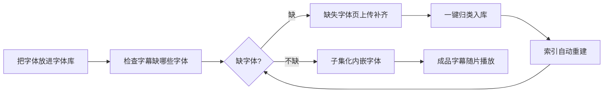

# 字体分类管家（Zitifenlei）使用手册

> 字体归档整理与 ASS 字幕字体检查插件：整理字体文件、检查字幕缺不缺字体，并把字幕用到的字体**子集化内嵌**进字幕，让任何播放器都能正确显示。

---

## 目录

1. [它能做什么](#1-它能做什么)
2. [安装与启用](#2-安装与启用)
3. [界面导航](#3-界面导航)
4. [快速上手](#4-快速上手)
5. [功能详解](#5-功能详解)
   - 5.1 仪表盘
   - 5.2 字体库（归档整理）
   - 5.3 检查（字幕缺字体检查）
   - 5.4 子集化（assfonts）
   - 5.5 缺失字体
   - 5.6 设置项逐项说明
6. [自动化与联动](#6-自动化与联动)
7. [常见问题](#7-常见问题)

---

## 1. 它能做什么

- **整理字体**：把散落的字体文件（`.ttf/.otf/.ttc/.woff/.woff2`）扫描/上传进统一的字体库，按「厂商 → 格式 → 字体名」归档，自动识别常见厂商（思源/Google、森泽 MO、华文 ST、方正等）。
- **检查字幕**：解析 ASS 字幕实际用到的字体清单，对照字体库告诉你哪些字体缺失、哪些字幕已内嵌字体。
- **子集化**：用 assfonts 把字幕用到的字体「精简 + 内嵌」进字幕文件，成品字幕脱离字体库也能显示（播放手机、电视、NAS 播放器都不乱码）。
- **全自动**：目录监控 + MoviePilot 入库联动，放进去就处理，处理完发通知。

---

## 2. 安装与启用

1. **安装**：MoviePilot → 插件市场 → 添加本仓库 `/LXT-A-X/MoviePilot-Plugins` → 搜索「字体分类管家」安装。
2. **依赖**：安装时自动按 `requirements.txt` 安装 (`fontTools`)；子集化内核 `assfonts`（Linux x86_64）随插件分发，无需额外安装。
3. **启用**：设置页 → 插件总开关 → 打开，保存配置生效。关闭后所有功能不可用、后台任务停止。

> 依赖状态在「仪表盘」顶部可查看；子集化功能需要「字体索引」构建成功后使用（详见 5.4）。

---

## 3. 界面导航

| 页面 | 作用 |
| --- | --- |
| **仪表盘** | 总体状态：字体总数/待整理/最近子集化/缺失字体统计、厂商分布、目录健康度、最近操作日志 |
| **字体库** | 左侧目录树（厂商/格式/字体）+ 右侧字体列表，上传、归档、全量检查、收藏、预览 |
| **检查** | ASS 字幕缺字体检查列表与详情，可上传字幕检查、全量检查字幕目录 |
| **子集化** | assfonts 状态与索引、全量子集化、待处理队列、处理结果（筛选/搜索/全部下载/重试失败） |
| **缺失字体** | 统一收集「检查缺失」与「子集化缺失」的字体，上传、归类入库、清除 |
| **设置** | 插件总开关、目录配置、扫描/归档模式、自动化、子集化、HDR 亮度 |

---

## 4. 快速上手

**第一次使用建议：**
1. **设置页**配置 4 个目录：`字体监控目录`（放待整理的字体）、`字体库目录`（归档目标，必填）、`ASS字幕目录监控`（要检查的字幕）、`ASS目录监控子集`（放进即子集化的字幕）；`子集化输出目录` 可选（成品同步位置）。保存。
2. **字体库页**点「全量检查」：把字体监控目录里的字体归档进字体库（自动识别厂商/格式归类）；以后把字体丢进监控目录也会自动归档（需开启监控）。
3. **子集化页**点「重建索引」：让 assfonts 扫描字体库生成字体索引（检查/子集化都依赖它）。
4. **子集化页**上传要处理的字幕，点「全量子集化」，成功后右侧结果区下载成品 `.assfonts.ass`。
5. 需要自动化就开启「是否启用监控」「是否自动执行监控结果」「入库自动检查/子集化」等开关。

---

## 5. 功能详解

### 5.1 仪表盘

- **状态条**：插件启用状态、数据库状态、运行依赖（fontTools 等）检测，可点击查看明细。
- **统计卡**：字体总数 / 待整理（监控目录里还没归档的字体数）/ 最近子集化数量 / 缺失字体。
- **厂商分布**：字体库按厂商的占比条（上下滚动列表）。
- **目录健康度**：4 个配置目录是否存在，一眼看出路径配错。
- **最近操作日志**：插件内部处理记录（含错误原因），排查问题先看这里。

### 5.2 字体库（归档整理）

- **左侧目录树**：按「厂商 → 格式(ttf/otf/ttc…) → 字体文件」展示字体库结构。
- **上传字体**：上传后进「待确认」，点「确认」或「一键整理」归档入库。
- **全量检查**：递归扫描字体监控目录，把里面的字体归档进字体库（归档成功自动重建 assfonts 索引）。
- **待确认区**：监控（自动执行关闭时）或上传产生的新字体先停在这里，确认后入库。
- **归档规则**：按「字体库/厂商/格式/基础名.后缀」存放（如 `字体库/思源黑体/otf/SourceHanSansCN-Bold.otf`），同名同格式自动跳过不覆盖；不同格式（`.ttf`/`.otf`）可共存。
- **厂商识别**：优先读字体内部制造商名；文件名 `MO+字母` 前缀识别为森泽；`ST`=华文；思源/Source Han=Adobe；Noto/Google=Google；其余归「未知厂商」。
- **「利用字体内部名称命名」开关**：开=用字体内部 PostScript 名归档（如 `SourceHanSansCN-Bold`）；关=保持原文件名。
- 字体条目可**收藏**（星标）、**预览**（TTC 等格式也能正常预览）、**删除**。

### 5.3 检查（字幕缺字体检查）

- 上传 ASS 字幕或点「全量检查」扫描 ASS 字幕目录后，逐条解析字幕用到的字体并对照字体库。
- 状态：**字体齐全 / 已子集化（自带内嵌字体）/ 缺字体**（列出缺失的字体名）。
- 顶部显示「**匹配基准**」：`子集索引（assfonts fonts.json）` 或 `字体库记录（索引未构建）`——提示当前检查是哪套口径。若显示后者，去「子集化」页点「重建索引」。
- 检查出的缺失字体自动进「缺失字体」页，可跳转补齐。

### 5.4 子集化（assfonts）

- **状态条**：`assfonts：就绪/未就绪`、`索引：N 个字体（构建时间）`。索引是检查与子集化的公共口径，**新字体入库后需「重建索引」**（归档/归类/入库时也会自动重建，一般无需手动）。
- **待处理队列（左栏）**：上传的字幕（手动）、「入库后自动子集化」或「ASS目录监控子集」收集的字幕（显示来源与时间，可移除）。
- **全量子集化**：处理左栏全部待处理字幕。运行中按钮转圈防连点，与入库子集化互斥。
- **结果区（右栏）**：成功/缺字体/可重试/失败/跳过状态，成功带输出文件路径、可下载；顶部状态下拉 + 字幕名搜索可筛选；「全部下载」按当前筛选一次性串行下载全部成功成品（未筛选=全部）。
  - 缺字体 → 点状态标签跳「缺失字体」页补字体，补齐后状态变「可重试」，点顶部「**重试失败**」重新子集化。
- **成品命名**：由「输出覆盖原文件」控制——开=直接替换源字幕（文件名不变）；关=保留源字幕，生成 `xx.assfonts.ass`。
- **子集字体夹**：`<字幕名>_subsetted` 备份夹是否在输出端保留由设置开关控制。

### 5.5 缺失字体

- 左栏「**检查缺失**」+ 右栏「**子集化缺失**」自动聚合，最多显示 5 种，其余可「展开全部」。
- **把字体文件拖进对应栏**（或缺字体失败后跳转本页上传）→ 点「**归类**」：归档入库 → 自动重建索引 → 通知 → 回子集化页重试。
- 「清除全部」清空已上传临时字体；单条可删除。

### 5.6 设置项逐项说明

| 区块 | 设置项 | 说明 |
| --- | --- | --- |
| 总开关 | 启用字体分类管家 | 关闭=所有功能不可用、后台任务停止；**后台有任务运行时无法关闭**（弹提示等任务完成再关，避免数据半截） |
| 目录 | 字体监控目录 | 放字体文件，监控到后自动归档（或进待确认） |
| 目录 | 字体库目录 | 归档目标，按厂商/格式/名称整理（必填） |
| 目录 | ASS字幕目录监控 | 字幕目录，监控到新字幕自动检查字体 |
| 目录 | ASS目录监控子集 | 放进的字幕直接进入子集化流程 |
| 目录 | 子集化输出目录 | 子集化成品的同步位置（可选） |
| 扫描模式 | 内部扫描(推荐)/文件名解析 | 内部=读字体内部元数据识别厂商与名称（更准）；文件名=直接解析文件名（快，依赖命名规范） |
| 归档模式 | 复制保留原文件/移动原文件 | 归档时复制还是移动源字体 |
| 归档 | 利用字体内部名称命名 | 开=用字体 PostScript 名归档；关=保原文件名 |
| 自动化 | 是否启用监控 | 总开关，统一控制三个监控目录启停 |
| 自动化 | 是否自动执行监控结果 | 开=监控到直接执行（归档/检查/子集化）；关=待定（待确认/待检查/待处理） |
| 自动化 | 入库自动检查字幕 | MP 整理入库时自动检查该剧字幕字体（与「入库后自动子集化」互斥） |
| 自动化 | 发送通知 | 归档/检查/子集化结果通过系统通知发送（字体与字幕分类消息） |
| 子集化 | 入库后自动子集化 | MP 入库时对新增字幕自动 assfonts 子集化（与「入库自动检查」互斥） |
| 子集化 | 输出覆盖原文件 | 开=成品替换源字幕；关=另生成 `xx.assfonts.ass` |
| 子集化 | 监控目录输出方式 | 复制到输出目录/移动到输出目录；监控来源成品按「输出目录/剧名/」分类输出 |
| 子集化 | 输出端保留子集化字体文件夹 | 是否生成 `*_subsetted` 备份夹（手动上传的始终不生成） |
| 子集化 | HDR 字幕亮度 | 成品字幕按档位压暗主色/描边/阴影（100%/85%/80%⭐/75%/70%/63%/50%），避免 HDR 下纯白字幕刺眼 |

---

## 6. 自动化与联动

**① 目录监控三条链路**（受「是否启用监控」总开关统一控制）：

| 目录 | 自动执行开 | 自动执行关 |
| --- | --- | --- |
| 字体监控目录 | 字体直接归档入库 | 进「待确认」等待一键整理 |
| ASS字幕目录监控 | 新字幕直接检查字体并发通知 | 登记等待检查 |
| ASS目录监控子集 | 新字幕直接子集化，成品按剧名分类同步输出目录 | 进「子集化-待处理」等待手动处理 |

**② MoviePilot 入库联动**（`SubtitleTransferComplete` 事件）：
- 开启「入库自动检查字幕」→ 剧集入库 30 秒聚合后自动检查该剧字幕，汇总通知（缺哪些字体一目了然）。
- 开启「入库后自动子集化」→ 入库字幕自动内嵌字体，成品留在媒体库原位置，播放即走。
- 两者互斥，一次只能开一个；与目录监控/全量子集化互斥执行，不并发打架。

**③ 索引自动重建闭环**：
- 字体归档 / 一键整理 / 缺失字体归类 → 自动重建 assfonts 索引（5 秒聚合去重）→ 检查与子集化立即用新索引，无需手动点「重建索引」。

**④ 缺失字体闭环**：
- 检查缺字体 → 缺失字体页上传 → 归类入库 → 索引自动重建 → 子集化缺失实时消失 → 对应记录变「可重试」→ 重试失败一键重新子集化。

**⑤ 安全性**：
- 全量检查/扫描/子集化运行中使用互斥锁，页面重复点击不会并发执行。
- **关闭插件**时会等待后台任务把当前条目完整处理完再停（60 秒兜底），不留「文件已入库但记录缺失」的半截状态；总开关在任务运行中直接拦截弹提示。
- 归档写库失败自动回滚已拷贝/移动的文件。

**⑥ 通知（可选）**：
- 字体归档 / 字幕检查 / 子集化成功 · 缺字体 · 失败分别归类聚合通知，6 秒窗口合并，批量放入不刷屏。

---

## 7. 常见问题

**Q：字体放进监控目录没反应？**
先看「是否启用监控」与「是否自动执行监控结果」是否打开；再在「仪表盘-目录健康度」确认目录路径可达；最后看「最近操作日志」。

**Q：字幕检查一直说缺字体，但字体明明在库里？**
检查「匹配基准」是否显示「字体库记录（索引未构建）」——去「子集化」页点「重建索引」，让检查与子集化用同一套索引口径。

**Q：新归档的字体子集化用不上？**
索引已自动重建，若个别情况没生效，手动点「重建索引」刷新。

**Q：TTC 字体预览失败/无法解析？**
插件会对 TTC 自动拆 face 重存并修复结构损坏的 cmap，正常字体零影响；仍失败请确认文件未损坏。

**Q：子集化成品的文件名怎么带「原字幕.assfonts.ass」？**
由「输出覆盖原文件」开关决定：关=保留源字幕另生成成品；开=直接替换源字幕。

**Q：HDR 片源字幕太亮刺眼？**
设置页开启「HDR 字幕亮度」并选档位（80% 主流推荐），子集化成品的颜色会自动压暗。